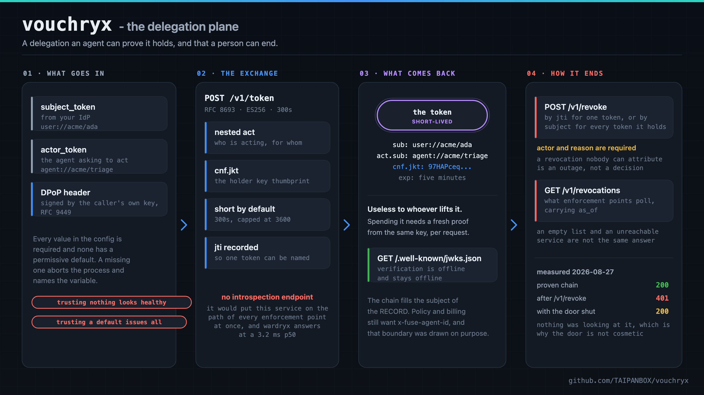
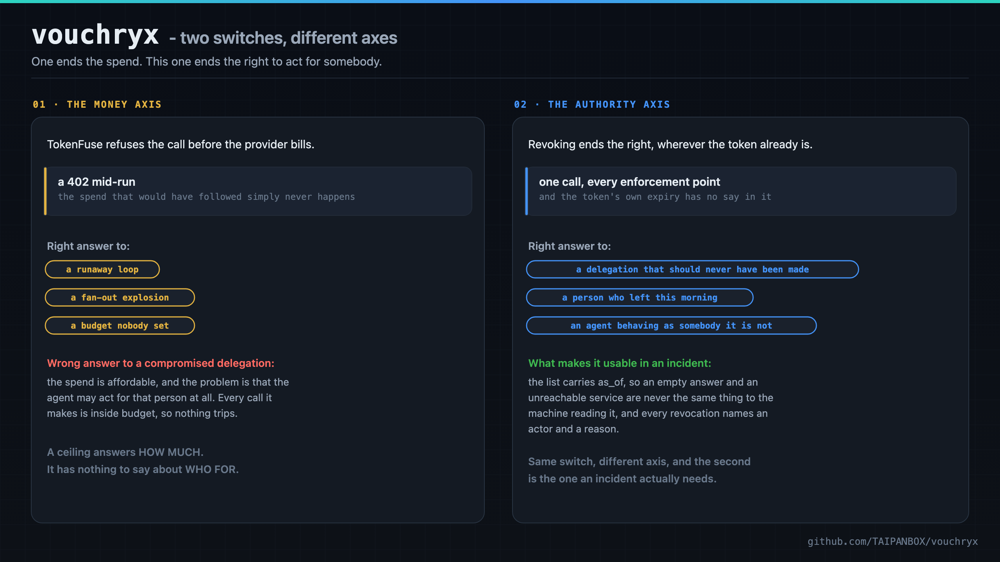
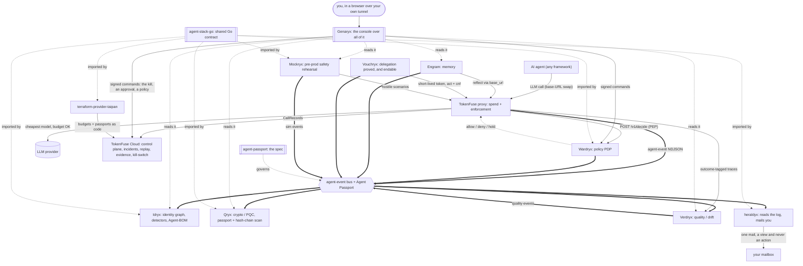

<div align="center">

# vouchryx - the delegation plane

**A delegation an agent can prove it holds, and that a person can end.**

[](https://github.com/TAIPANBOX/vouchryx/actions/workflows/ci.yml)




</div>

RFC 8693 token exchange with nested `act`, sender-constrained by RFC 9449 DPoP.
Short-lived tokens, a revocation list an enforcement point can poll and act on,
and public keys anybody can verify against offline.

<div align="center">



<sub>The same service as its room on <a href="https://it-rat.com/services/vouchryx.html">it-rat.com</a> draws it.</sub>

</div>

---

## Where this fits in the stack

Vouchryx is the delegation plane: it issues the proof the Agent Passport spec
deliberately does not, and it is the only place in the stack where an authority
can be ended without waiting for anything to expire.



## The gap it closes

`agent-passport` SPEC section 2 disclaims two things deliberately:

> Not an authentication protocol. The Passport names an agent; it does not
> prove possession.

> Not a freshness claim. The delegation chain records who acted on behalf of
> whom, not when.

So the estate holds the **record** of a delegation and points at a mechanism
that did not exist. This is that mechanism. Nothing here replaces
`on_behalf_of`; this is what makes it provable and what lets it be ended.

TokenFuse's kill switch stops **money**: a 402 mid-run, before the provider
bills. Revoking a delegation stops **authority**: the right to act on somebody's
behalf ends at every enforcement point at once, whatever the token says. Same
switch, different axis, and the second is the one an incident needs.

## Surface

| | |
|---|---|
| `POST /v1/token` | RFC 8693 exchange. Input: `subject_token` and `actor_token`, plus a `DPoP` header. Output: a short-lived JWT with nested `act` and `cnf.jkt`. |
| `POST /v1/revoke` | By `jti` for one token, or by `subject` for every token an agent already holds. `actor` and `reason` are required. |
| `GET /v1/revocations` | What enforcement points poll. Carries `as_of`, so an empty list and an unreachable service are not the same answer. |
| `GET /.well-known/jwks.json` | Public keys, so verification is offline. |

There is deliberately **no introspection endpoint**. It would put this service
on the request path of every enforcement point at once, and wardryx runs at a
3.2 ms p50.

## Configuration

Every value is required except the first, and none has a permissive default.

```
VOUCHRYX_ADDR             where to listen (default 127.0.0.1:4310)
VOUCHRYX_ISSUER           the `iss` this service puts on every token it mints
VOUCHRYX_SIGNING_KEY      path to a PEM EC private key; it issues ES256
VOUCHRYX_TRUSTED_ISSUERS  `iss|aud|jwks-path`, one per line
VOUCHRYX_TTL_SECONDS      default 300, capped at 3600
VOUCHRYX_EVENTS_PATH      agent-event NDJSON; unset means nothing is recorded
```

A missing or malformed value **aborts the process** and names the variable. A
token service that came up trusting nothing would issue nothing and look
healthy; one that came up trusting a default would issue everything.

## Walking the loop

The Surface table above documents four endpoints, and until 2026-08-27 nothing
outside this repository's own tests could call them: an RFC 8693 exchange takes
two signed input tokens and a DPoP proof whose public key travels in the JWS
header, which is a JOSE client before it is a curl command. The driver that
proved the end-to-end path on 2026-08-26 was written in a scratch directory and
lost with it.

`vouchryx-demo` is that client, shipped.

```sh
go build -o vouchryx-demo ./cmd/vouchryx-demo

# a demo issuer, this service's own signing key, and the caller's key
./vouchryx-demo keygen -out idp -kid idp-1
./vouchryx-demo keygen -out signing
./vouchryx-demo keygen -out holder

VOUCHRYX_ISSUER=http://127.0.0.1:4310 \
VOUCHRYX_SIGNING_KEY=signing.pem \
VOUCHRYX_TRUSTED_ISSUERS="https://idp.local|http://127.0.0.1:4310|idp.jwks.json" \
  ./vouchryx &

./vouchryx-demo exchange -url http://127.0.0.1:4310 \
  -idp-key idp.pem -kid idp-1 \
  -iss https://idp.local -aud http://127.0.0.1:4310 \
  -subject user://acme/ada -actor agent://acme/triage \
  -holder-key holder.pem
```

which prints a token carrying, measured on 2026-08-27:

```json
{ "iss": "http://127.0.0.1:4310", "sub": "user://acme/ada",
  "act": { "sub": "agent://acme/triage" },
  "cnf": { "jkt": "97HAPceqERXiSYV7HglWE8AQM2ULJ7Uu_aGryI15Tiw" },
  "iat": 1787862197, "exp": 1787862497, "jti": "McIAWz0jmD82xc8uv7TdYQ" }
```

`cnf.jkt` is the thumbprint of `holder.pem`, which is what makes the token
useless to anybody who lifts it: spending it needs a **fresh** proof from the
same key, per request.

```sh
./vouchryx-demo proof -key holder.pem -htm POST \
  -htu http://127.0.0.1:4100/v1/messages
```

**It is a client and it verifies nothing.** Every check stays here, at the
service, which is the only shape in which shipping a minting helper beside a
service that refuses for a living is safe: a wrong credential minted there is
refused here, loudly. Its own tests assert exactly that, by standing up this
server and requiring it to accept, or refuse, what the client produced.

## Where the crypto lives

**Not here.** Signing, verification, the algorithm allowlist, the DPoP proof
check and the `act` chain are `agent-stack-go/delegation`, from v0.8.0. This
service imports it; so do `wardryx`, `idryx`, `scopyx`, `heraldyx` and
`mockryx` when they verify what it issues.

That is not tidiness. Two implementations of "is this signature valid" that
disagree is a hole nobody sees until somebody walks through it, and the issuer
having its own copy is the worst arrangement available: the one process that
mints tokens would be the one process nobody else's tests cover.

It lived here for exactly one day, which was the day it took to find out that a
proof's key lookup could never match and that the chain lost its root. Both
tests moved with the code.

## The four things that make this hard to get wrong

**The algorithm comes from the key, never from the token header**, and **a
token is verified with the key it names and no other**. Both now live in
`agent-stack-go/delegation` with their tests; the second exists because a
planted mutant survived here first, and the test that closed it passed for the
wrong reason before that.

**The chain grows at the right end.** RFC 8693 nests `act` current-first;
agent-passport orders `on_behalf_of` root-first. Getting it backwards produces a
token that verifies perfectly and asserts that the root delegated to nobody.
And the two are not one list reversed: the RFC keeps the subject OUT of `act`,
the estate puts the root INTO the chain, so the mapping is `[sub] + reverse(act)`.
*Found by the end-to-end test, which caught a chain with the human missing from
it.*

**A refusal is not an oracle.** Every rejection is the same OAuth error with no
detail about which check failed. Told which of eight failed, an attacker walks
them one at a time. The detail goes to the event stream.

## Events

`delegation_issued` (info), `delegation_denied` (high), `delegation_revoked`
(high), in the shared `taipanbox.dev/agent-event` envelope. Severity is fixed
per type here exactly as it is in tokenfuse's own crate, so no call site can
pick one.

## Testing

63 tests. Tier T3: these are authorization decisions where a wrong answer is
silent.

**Ten mutants were planted in the security paths while that code lived here;
nine were caught immediately and one survived.** Closing it is
`TestATokenIsVerifiedWithTheKeyItNamesAndNoOther`, which moved to
`agent-stack-go` with the code it guards.

Coverage: `revoke` 95%, `config` 93%, `api` 75%. The JOSE, DPoP and chain
coverage moved with the code to `agent-stack-go`.

```bash
go test ./...
./scripts/the-algorithm-comes-from-the-key.sh
./scripts/features-are-bound.sh
./scripts/gates-have-teeth.sh    # needs a clean tree
```

## NOT PROVEN

Stated here rather than left to be discovered.

- **The revocation list is in memory.** A restart forgets, and every revoked
  token whose `exp` has not passed becomes live again. This is the one thing
  here that needs a store before the service is trusted with a real incident.
- **The DPoP replay cache is in memory too**, bounded by a 60-second window. For
  one window after a restart, a captured proof could be replayed once.
- **No enforcement point verifies these tokens on a request path yet.** The
  library half (A2 in the plan) is built in both languages as of 2026-08-26,
  and the revocation consumer beside it, so the estate can now read what this
  issues and act on a revocation. What is still missing is a caller: no
  deployed request path checks a delegation token or polls `/v1/revocations`.
  Until one does, this service is correct and unconsumed.
- **Where a `subject_token` comes from is out of scope.** This accepts one from
  a configured issuer; obtaining it from a customer's own IdP is a deployment
  shape that does not exist yet.
- **Nothing here has been run against a real IdP**, only against tokens minted
  by the tests using the same code path. Interoperability with Okta, Entra or
  Auth0 is untested and unclaimed.
- **No fuzzing**, no load measurement, no TLS. It binds HTTP and warns when the
  bind is routable; terminating TLS is the deployment's job and is not
  demonstrated.
- **The name is a placeholder** and was never confirmed.
- **`scripts/the-algorithm-comes-from-the-key.sh` no longer measures anything
  here**, because the file it reads moved. It is removed rather than left
  reporting OK on nothing: a gate whose subject is gone must say so, and the
  simplest way to say it is not to have it. The rule it held is an invariant of
  `agent-stack-go` now, with its own gate there.

## Licence

Apache-2.0.

## Status

- [x] RFC 8693 exchange with nested `act`, ES256, short-lived by default
- [x] Sender-constrained with RFC 9449 DPoP, `cnf.jkt` bound to the caller key
- [x] Revocation by `jti` or by `subject`, with a required actor and reason
- [x] `vouchryx-demo` ships the client, so the loop is walkable from a shell
- [x] `stack-up --with-delegation` brings it up in front of the gateway
- [ ] An upper IdP in the sandbox; the profile mints a demo issuer instead
- [ ] Rooms in the other repos' shared stack diagram, which still shows seven planes

## Licence

Apache-2.0, like the rest of the stack. See [LICENSE](./LICENSE).
