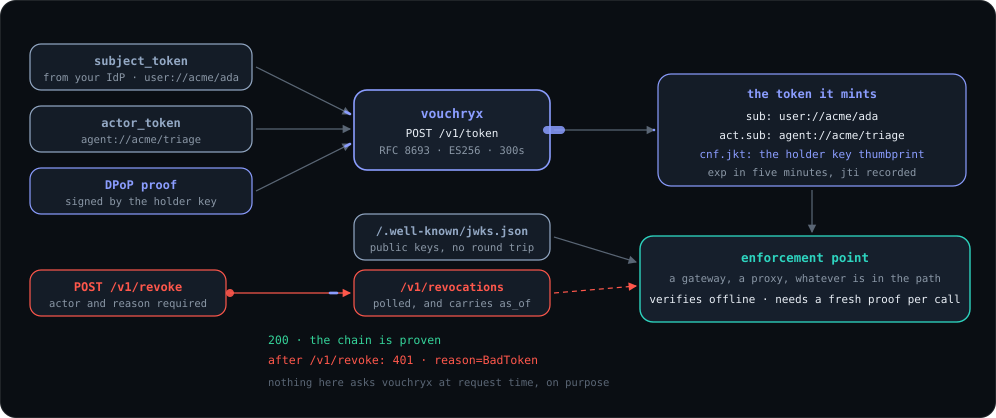
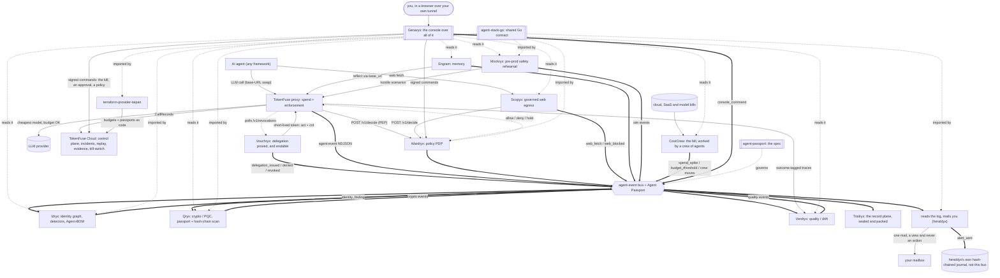

<div align="center">

# vouchryx - the delegation plane

**A delegation an agent can prove it holds, and that a person can end.**

[](https://github.com/TAIPANBOX/vouchryx/actions/workflows/ci.yml)


</div>

RFC 8693 token exchange with nested `act`, sender-constrained by RFC 9449 DPoP.
Short-lived tokens, a revocation list an enforcement point can poll and act on,
and public keys anybody can verify against offline.

<div align="center">


<sub>The same service as its room on <a href="https://it-rat.com/services/vouchryx.html">it-rat.com</a> draws it.</sub>

</div>

<div align="center">



<sub>The same service as its room on <a href="https://it-rat.com/services/vouchryx.html">it-rat.com</a> draws it, lifted from that page so the two cannot drift apart.</sub>

</div>

---

## Where this fits in the stack

Vouchryx is the delegation plane: it issues the proof the Agent Passport spec
deliberately does not, and it is the only place in the stack where an authority
can be ended without waiting for anything to expire.



## The gap it closes

`agent-passport` SPEC section 2 disclaims two things deliberately:

> Not an authentication protocol. The Passport names an agent; it does not
> prove possession.

> Not a freshness claim. The delegation chain records who acted on behalf of
> whom, not when.

So the estate holds the **record** of a delegation and points at a mechanism
that did not exist. This is that mechanism. Nothing here replaces
`on_behalf_of`; this is what makes it provable and what lets it be ended.

TokenFuse's kill switch stops **money**: a 402 mid-run, before the provider
bills. Revoking a delegation stops **authority**: the right to act on somebody's
behalf ends at every enforcement point at once, whatever the token says. Same
switch, different axis, and the second is the one an incident needs.

## Surface

| | |
|---|---|
| `POST /v1/token` | RFC 8693 exchange (`grant_type=urn:ietf:params:oauth:grant-type:token-exchange`). Input: `subject_token` and `actor_token`, plus a `DPoP` header. Output: a short-lived JWT with nested `act` and `cnf.jkt`. Since W3, the same route also runs Cross App Access's jwt-bearer grant (`grant_type=urn:ietf:params:oauth:grant-type:jwt-bearer`, `assertion=<ID-JAG>`, `client_secret_basic`); see "Cross App Access" below. |
| `POST /v1/revoke` | By `jti` for one token, or by `subject` for every token naming that agent anywhere in its chain: at this door since 2026-09-17, and at the enforcement points from agent-stack-go#61 and tokenfuse#298 on. `actor` and `reason` are required. A `jti` revocation ends one token, not the ones already exchanged from it. |
| `GET /v1/revocations` | What enforcement points poll. Carries `as_of`, so an empty list and an unreachable service are not the same answer. |
| `GET /.well-known/jwks.json` | Public keys, so verification is offline. |
| `GET /.well-known/oauth-authorization-server` | RFC 8414 metadata: this service's own endpoints and grants. Names no trusted issuer and no configured client. |

There is deliberately **no introspection endpoint**. It would put this service
on the request path of every enforcement point at once, and wardryx runs at a
3.2 ms p50.

## Configuration

Every value is required except the first, and none has a permissive default.

```
VOUCHRYX_ADDR             where to listen (default 127.0.0.1:4310)
VOUCHRYX_ISSUER           the `iss` this service puts on every token it mints,
                          and the base every DPoP htu is checked against, so
                          behind a TLS terminator it must be the public URL
VOUCHRYX_SIGNING_KEY      path to a PEM EC private key; it issues ES256
VOUCHRYX_TRUSTED_ISSUERS  `iss|aud|jwks-path`, one per line
VOUCHRYX_TTL_SECONDS      default 300, capped at 3600
VOUCHRYX_EVENTS_PATH      agent-event NDJSON; unset means nothing is recorded
VOUCHRYX_REVOCATIONS_PATH revocations kept on disk across a restart; unset,
                          a restart forgets them
VOUCHRYX_CLIENTS         Cross App Access client table, `client_id|agent://td/path|
                          sha256:<64 hex>` per line; unset closes the jwt-bearer
                          grant (unauthorized_client to every call)
VOUCHRYX_RESOURCES       comma-separated absolute URLs the jwt-bearer grant may
                          issue for; required once VOUCHRYX_CLIENTS is set
VOUCHRYX_XAA_REQUIRE_DPOP "true" or "false" (default); requires a DPoP proof on
                          the jwt-bearer grant when true
```

A missing or malformed value **aborts the process** and names the variable. A
token service that came up trusting nothing would issue nothing and look
healthy; one that came up trusting a default would issue everything.

## Walking the loop

The Surface table above documents four endpoints, and until 2026-08-27 nothing
outside this repository's own tests could call them: an RFC 8693 exchange takes
two signed input tokens and a DPoP proof whose public key travels in the JWS
header, which is a JOSE client before it is a curl command. The driver that
proved the end-to-end path on 2026-08-26 was written in a scratch directory and
lost with it.

`vouchryx-demo` is that client, shipped.

```sh
go build -o vouchryx-demo ./cmd/vouchryx-demo

# a demo issuer, this service's own signing key, and the caller's key
./vouchryx-demo keygen -out idp -kid idp-1
./vouchryx-demo keygen -out signing
./vouchryx-demo keygen -out holder

VOUCHRYX_ISSUER=http://127.0.0.1:4310 \
VOUCHRYX_SIGNING_KEY=signing.pem \
VOUCHRYX_TRUSTED_ISSUERS="https://idp.local|http://127.0.0.1:4310|idp.jwks.json" \
  ./vouchryx &

./vouchryx-demo exchange -url http://127.0.0.1:4310 \
  -idp-key idp.pem -kid idp-1 \
  -iss https://idp.local -aud http://127.0.0.1:4310 \
  -subject user://acme/ada -actor agent://acme/triage \
  -holder-key holder.pem
```

which prints a token carrying, measured on 2026-08-27:

```json
{ "iss": "http://127.0.0.1:4310", "sub": "user://acme/ada",
  "act": { "sub": "agent://acme/triage" },
  "cnf": { "jkt": "97HAPceqERXiSYV7HglWE8AQM2ULJ7Uu_aGryI15Tiw" },
  "iat": 1787862197, "exp": 1787862497, "jti": "McIAWz0jmD82xc8uv7TdYQ" }
```

`cnf.jkt` is the thumbprint of `holder.pem`, which is what makes the token
useless to anybody who lifts it: spending it needs a **fresh** proof from the
same key, per request.

```sh
./vouchryx-demo proof -key holder.pem -htm POST \
  -htu http://127.0.0.1:4100/v1/messages
```

**The second hop.** A token this service issued comes back as the
`subject_token` of a new exchange, so the delegation grows a hop: the HOLDER
presents it, proves its own key, and names the delegate through an
`actor_token` the delegate's IdP bound to the delegate's key (`cnf.jkt`, RFC
9449 section 6). The result keeps the root, appends the delegate to `act`, and
is bound to the delegate's key. For that this service must trust its own
issuer as an input, which is the operator's explicit line and never a default:

```sh
# one issuer per line: the IdP, then this service's own key set
VOUCHRYX_TRUSTED_ISSUERS=$'https://idp.local|http://127.0.0.1:4310|idp.jwks.json\nhttp://127.0.0.1:4310|http://127.0.0.1:4310|signing.jwks.json'
```

The token being handed on must have been minted for this service's own
audience (`audience` omitted, or equal to `VOUCHRYX_ISSUER`), or the self-trust
entry refuses it. A bound token presented by anyone but its holder issues
nothing, an unbound delegate credential issues nothing (the delegator would be
minting a token in the delegate's name bound to its own key), and a revoked
token issues nothing, whichever party in its chain the revocation names.

**It is a client and it verifies nothing.** Every check stays here, at the
service, which is the only shape in which shipping a minting helper beside a
service that refuses for a living is safe: a wrong credential minted there is
refused here, loudly. Its own tests assert exactly that, by standing up this
server and requiring it to accept, or refuse, what the client produced.

## Cross App Access

`@decided 2026-09-24`: this service is also a resource authorization server
for Cross App Access, the pattern an enterprise identity provider uses to let
one app hand another app proof of who a person is without ever sharing a
password or a session: RFC 7523's jwt-bearer grant, redeeming an ID-JAG
(`draft-ietf-oauth-identity-assertion-authz-grant-04`) for a short-lived
access token scoped to one configured resource. `POST /v1/token` runs it
beside the existing exchange, on `grant_type`.

Closed by construction: with no `VOUCHRYX_CLIENTS` configured, every call
answers `unauthorized_client`, and `GET /.well-known/oauth-authorization-server`
does not advertise the grant at all.

```sh
# a client's secret, and the digest VOUCHRYX_CLIENTS holds instead of it
printf '%s' 'xaa-demo-secret' | shasum -a 256

VOUCHRYX_ISSUER=http://127.0.0.1:4310 \
VOUCHRYX_SIGNING_KEY=signing.pem \
VOUCHRYX_TRUSTED_ISSUERS="https://idp.local|http://127.0.0.1:4310|idp.jwks.json" \
VOUCHRYX_CLIENTS="console|agent://acme/console|sha256:ec57e360a7beebe60564bab19e0186a4224a4a44b15461dc139d5130ba6783d7" \
VOUCHRYX_RESOURCES="https://broker.acme.example/mcp" \
  ./vouchryx &

./vouchryx-demo xaa -url http://127.0.0.1:4310 \
  -idp-key idp.pem -kid idp-1 -iss https://idp.local -aud http://127.0.0.1:4310 \
  -sub alice@acme.example -client-id console -client-secret xaa-demo-secret \
  -resource https://broker.acme.example/mcp
```

which prints a token carrying, measured on 2026-09-24:

```json
{ "iss": "http://127.0.0.1:4310",
  "sub": "user://idp.local/x-616c6963654061636d652e6578616d706c65",
  "act": { "sub": "agent://acme/console" },
  "client_id": "console", "idp_iss": "https://idp.local",
  "idp_sub": "alice@acme.example",
  "aud": "https://broker.acme.example/mcp",
  "iat": 1790221720, "exp": 1790222020,
  "jti": "nz0kiLKjhkw7-GE7O6MoRQ" }
```

`sub` is the mapped identity, `user://<lowercase host of the IdP's iss>/<IdP
sub>`; the IdP's own `alice@acme.example` is hex-encoded behind an `x-`
prefix because `@` and `.` in that position are outside the safe character
set this service already uses for a chain entry's path, so the raw value is
never embedded where a `/` or a stray scheme separator could be read as
something it is not. `exp - iat` is exactly 300 seconds, the five-minute cap
(D1), regardless of what `VOUCHRYX_TTL_SECONDS` allows the token-exchange
grant to run for.

A wrong client secret is refused with `401 {"error":"invalid_client"}` and a
`WWW-Authenticate: Basic` header; the operator's log names the reason
(`client_auth_failed`), the caller never sees it.

## Where the crypto lives

**Not here.** Signing, verification, the algorithm allowlist, the DPoP proof
check and the `act` chain are `agent-stack-go/delegation`, from v0.8.0. This
service imports it, and today it is the only Go service that does: measured
2026-09-16 over every Go repository in the stack, `wardryx`, `idryx`,
`scopyx`, `heraldyx` and `mockryx` import nothing from that package. What this
service issues is verified at TokenFuse's two doors (its Rust `delegation`
crate, offline, from a configured issuer and JWKS) when an operator turns
that on, and nowhere else yet. Wardryx reads a `chain_proven` fact a door
established; it does not verify a token itself.

That is not tidiness. Two implementations of "is this signature valid" that
disagree is a hole nobody sees until somebody walks through it, and the issuer
having its own copy is the worst arrangement available: the one process that
mints tokens would be the one process nobody else's tests cover.

It lived here for exactly one day, which was the day it took to find out that a
proof's key lookup could never match and that the chain lost its root. Both
tests moved with the code.

## The four things that make this hard to get wrong

**The algorithm comes from the key, never from the token header**, and **a
token is verified with the key it names and no other**. Both now live in
`agent-stack-go/delegation` with their tests; the second exists because a
planted mutant survived here first, and the test that closed it passed for the
wrong reason before that.

**The chain grows at the right end.** RFC 8693 nests `act` current-first;
agent-passport orders `on_behalf_of` root-first. Getting it backwards produces a
token that verifies perfectly and asserts that the root delegated to nobody.
And the two are not one list reversed: the RFC keeps the subject OUT of `act`,
the estate puts the root INTO the chain, so the mapping is `[sub] + reverse(act)`.
*Found by the end-to-end test, which caught a chain with the human missing from
it.*

**A refusal is not an oracle.** Every rejection is the same OAuth error with no
detail about which check failed. Told which of eight failed, an attacker walks
them one at a time. The detail goes to the event stream.

## Events

`delegation_issued` (info), `delegation_denied` (high), `delegation_revoked`
(high), in the shared `taipanbox.dev/agent-event` envelope. Severity is fixed
per type here exactly as it is in tokenfuse's own crate, so no call site can
pick one.

## Testing

165 tests. Tier T3: these are authorization decisions where a wrong answer is
silent.

**Ten mutants were planted in the security paths while that code lived here;
nine were caught immediately and one survived.** Closing it is
`TestATokenIsVerifiedWithTheKeyItNamesAndNoOther`, which moved to
`agent-stack-go` with the code it guards. Cross App Access (`internal/xaa`,
W3) planted its own set, named in `CLAUDE.md` invariants 18 to 20; the one
survivor there is caught only by the happy-path test, not by the one named
for the credential it breaks, and both are named so the reason is not lost.

Coverage, measured 2026-09-24 with `go test ./internal/<pkg>/... -cover`
after Cross App Access landed: `xaa` 95.1% (new: pure functions with no HTTP
or process boundary to leave untested), `config` 95.9% (was 95.2%), `revoke`
86.4% (unchanged), `demo` 75.0% (was 70.8%), `api` 84.2% (was 87.5%, the one
that moved down: `internal/xaa`'s own share of the request path is now
counted in `xaa`, not here, and a few of `tokenJWTBearer`'s internal
`server_error` paths, a bad random source, a signing failure, are the same
kind of practically unreachable branch the exchange handler already leaves
uncovered). The JOSE, DPoP and chain coverage moved with the code to
`agent-stack-go`.

```bash
go test ./... -race
go vet ./...
staticcheck ./...
./scripts/features-are-bound.sh
./scripts/readme-numbers.sh
./scripts/every-refusal-reaches-the-operator.sh
./scripts/gates-have-teeth.sh    # needs a clean tree
```

## NOT PROVEN

Stated here rather than left to be discovered.

- **The revocation store is a local file**: no replication, no cross-instance
  sharing, compacted only at start (a long-running process under heavy
  revocation grows it until the next start), and fsync ordering is held by
  reading, not by a test.
- **The DPoP replay cache is in memory too**, bounded by a 60-second window. For
  one window after a restart, a captured proof could be replayed once.
- **One enforcement point verifies these tokens on a request path, and it is
  the only one.** TokenFuse's gateway has been that caller since 2026-08-26:
  `crates/gateway/src/revocations.rs` polls `GET /v1/revocations` in a
  background task, installs the snapshot under a lock, and both doors read it
  synchronously through `chainproof::resolve`, the LLM proxy in `proxy.rs` and
  the MCP broker in `mcpbroker.rs`, where a revoked delegation answers 401. It
  is off until `TOKENFUSE_DELEGATION_REVOCATIONS` names a URL; naming one makes
  the first fetch a startup condition, the fail mode defaults to closed, and
  naming it with no issuer configured is refused with the same exit code as any
  other check that could never fire. What is still missing is a second caller:
  no Go service in the estate sets `delegation.Options.Revoked`, so
  `delegation.Revocations` in `agent-stack-go` is a cache nothing constructs.
- **Where a `subject_token` comes from is out of scope.** This accepts one from
  a configured issuer; obtaining it from a customer's own IdP is a deployment
  shape that does not exist yet.
- **Nothing here has been run against a real IdP**, only against tokens minted
  by the tests using the same code path. Interoperability with Okta, Entra or
  Auth0 is untested and unclaimed.
- **No fuzzing**, no load measurement, no TLS. It binds HTTP and warns when the
  bind is routable; terminating TLS is the deployment's job and is not
  demonstrated here. The DPoP `htu` it checks is built from `VOUCHRYX_ISSUER`,
  not from the request's own socket, so a terminator rewriting the scheme and
  host in front of it does not by itself break the check; this is measured
  only through `httptest` requests carrying a literal URL, never through a
  real reverse proxy or TLS terminator.
- **The hand-off has not been run against a real IdP's bound tokens**, only
  against credentials the tests bind the same way; and there is no lineage in
  a token, so revoking a parent by `jti` does not cascade to tokens already
  exchanged from it (revoke the party by `subject` for that).
- **The name is a placeholder** and was never confirmed.
- **`scripts/the-algorithm-comes-from-the-key.sh` no longer measures anything
  here**, because the file it reads moved. It is removed rather than left
  reporting OK on nothing: a gate whose subject is gone must say so, and the
  simplest way to say it is not to have it. The rule it held is an invariant of
  `agent-stack-go` now, with its own gate there.
- **Cross App Access has not been run against a real identity provider.**
  `internal/xaa` and `vouchryx-demo xaa` are exercised against tokens this
  repository's own tests and demo client mint, the same limit the rest of
  this section already states for the token-exchange grant; open-source
  Keycloak issues an ID-JAG only experimentally as of this file's own
  research, and Okta's Cross App Access needs a tenant and an early-access
  mail nobody has sent yet.
- **The jti replay cache is in memory, bounded, and a restart forgets it**,
  the same shape the DPoP replay window already has: for one assertion's
  lifetime after a restart, a captured ID-JAG could be redeemed once more
  than it should be.
- **`client_secret_basic` is the only client authentication method.**
  `private_key_jwt`, which the MCP extension also names, is not implemented;
  a client that only supports it cannot use this grant.

## Licence

Apache-2.0.

## Status

- [x] RFC 8693 exchange with nested `act`, ES256, short-lived by default
- [x] Sender-constrained with RFC 9449 DPoP, `cnf.jkt` bound to the caller key
- [x] Revocation by `jti` or by `subject`, with a required actor and reason
- [x] `vouchryx-demo` ships the client, so the loop is walkable from a shell
- [x] `stack-up --with-delegation` brings it up in front of the gateway
- [x] Cross App Access (RFC 7523 jwt-bearer, an ID-JAG in), closed while
      `VOUCHRYX_CLIENTS` is unset; `vouchryx-demo xaa` walks it from a shell
- [ ] An upper IdP in the sandbox; the profile mints a demo issuer instead
- [ ] Rooms in the other repos' shared stack diagram, which still shows seven planes

## Licence

Apache-2.0, like the rest of the stack. See [LICENSE](./LICENSE).
